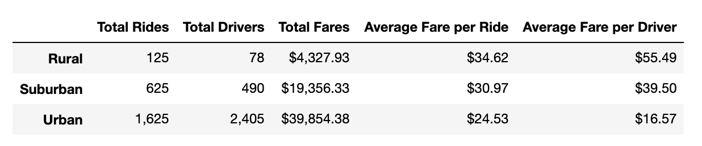
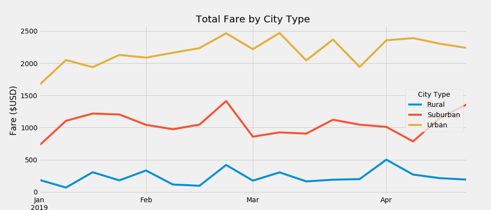
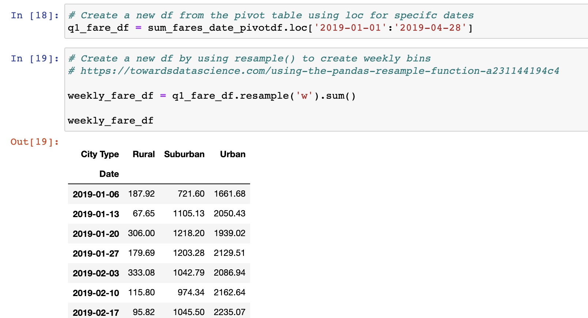

# PyBer_Analysis_Report

## Background and Results

Versions:
- Python 3.7.7
- Matplotlib 3.1.3

### Purpose

The purpose of this analysis was to look at ride share data that was gathered during 2019 using the PyBer ride share app. The purpose was to compare driver, ride, and fare data across 3 different city types (rural, suburban, and urban). Questions answered include: Which city type has the most number of rides? Which city type has the highest amount of drivers? Which city type produces the most amount of fares (income)? What is the average fare per ride and average fare per driver for each city type? 

### Technical Analysis

To complete this analysis, data was pulled from two data files: city_data.csv and ride_data.csv. This data was merged into different dataframes that allowed the driver, fare, and ride data to be counted and summed. Calculations were completed to obtain corresponding averages and the results were displayed in graphs form using matplotlib.pyplot. 

### Results 

The results show that for 2019, urban areas had the highest amount of total rides, drivers, and total fare count while rural areas had the lowest amount of total rides, drivers, and total fare count. Urban areas have roughly thirteen times the amount of rides and thirty times the amount drivers when compared to rural areas. Despite this, the average fare per ride and the average fare per driver was highest in rural areas and lowest in urban areas. There was several factors that could impact this including that there are far less available drivers in rural areas and that the average trip is longer in rural environments then in urban locations. From January to April 2019, urban areas fluctuated between having four to ten times the amount of total fares when compared to rural environments, with suburban total fares in the middle. See the below DataFrame table and multi-line graph for more details:

### Summary

Urban areas have the highest amount of total rides and drivers, therefore producing the most amount of fares (income) for PyBer when compared to rural and suburban locations. Rural areas have the lowest amount of rides and drivers, which means rural areas produce the lowest amount of fares.

## Challenges Encountered and Overcome

### Challenges and Difficulties Encountered

The challenges and difficulties encountered were all related to coding and hitting road blocks with certain errors. These issues were resolved by consulting Stack Overflow and other online resources to provide solutions. Another key resource was consulting the teaching assistants during office hours to help walk through some of the errors that could not be figured out.

### Technical Analyses Used

For example, one issue was related to creating a new DataFrame from another DataFrame using the .resample() function. I kept on getting errors during this process and needed and consult an online resource and a TA to provide guidance to resolve the error, which I learned was related to improper syntax. See below screenshot of the section of code: 

## Recommendations and Next Steps

### Recommendations for Future Analysis

### Additional Analysis 1

* Once additional analysis that could be preformed is to compare the total fare by city type for the 1st, 2nd, 3rd, and 4th quarters of the year to see if there are any general trends throughout the year. Are there times of the year when PyBer could focus their marketing efforts or promotions?

* To complete this, I would run the .loc() function for each quarter on the sum_fares_date_pivotdf and make each quarter into a new DataFrame. I would then resample the four new quarterly Dataframes on a weekly or monthly basis, graph them, and compare the four quarters for any patterns or trends.

### Additional Analysis 2

* Another additional analysis could be to look at the individual cities that make up each city type (rural, urban, suburban) and sum() and count() fares, rides, and drivers for each city to see which cities themselves have the highest / lowest amount of drivers, rides, and fares for each rural, urban, suburban category. Are there certain cities that PyBer should focus their marketing efforts or promotions in?

* To complete this, I would use the .groupby() function on the suburban_cities_df, urban_cities_df, and the rural_cities_df and group by city name. From there, you could sum() and count() fares, rides, and drivers for each city and compare the output for any relevant information.